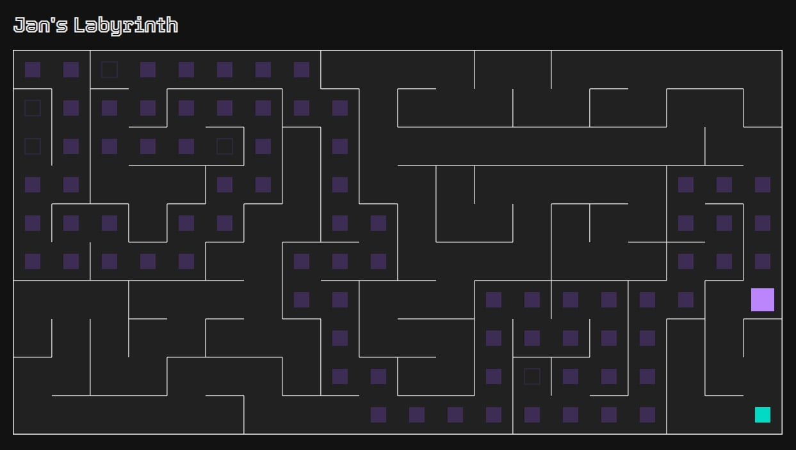

### Jan's Labyrinth

A maze generation react app with animated maze solver/walker.

## Algorithm

Uses the depth-first search / backtracking algoritm to generate a maze. The maze solver is based off the same algorithm but has some added features, namely line-of-sight detection of the exit and dead end corridors.

## Project name

'Jan's Labyrinth' is a play on the name 'Pan's Labyrinth' (the classic 2006 fantasy film by Guillermo del Toro), where 'Jan' represents the month the project started :grinning:

### Build

npm run build

### Run

npm run start

### Test

npm run test
